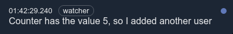
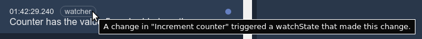
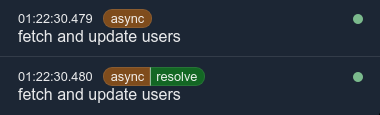
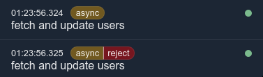

<!-- #header -->
# @diffx/angular
<!-- end -->

<!-- #before-usage -->
## Setup

### Fix angular change detection and the `async` pipe
Angular has the concept of code running inside zones, and anything running outside a zone will not trigger change
detection.

To ensure observables returned from Diffx are run in the correct zone, import zone-patch-rxjs in your `polyfills.ts`
file after your import of `zone`.

```javascript
import 'zone.js/dist/zone';
import 'zone.js/dist/zone-patch-rxjs'; // <--- This thing right here
```

<!-- end -->

<!-- #watchState() -->
### Observe state

`observeState(stateGetter)` is used for creating an observable of the state.

* `stateGetter` - a function which returns the state(s) to be observed

```javascript
import { observeState } from '@diffx/angular';
import { clickCounter } from './createState-example';

observeState(() => clickCounter.count); // --> observable
```
<!-- end -->

<!-- #controlling watchState -->
<details>
    <summary><strong>Controlling how state is observed</strong></summary>

To have fine-grained control over how the state is observed, an options object can be provided as the second argument.

```javascript
import { observeState } from '@diffx/rxjs';
import { clickCounter } from './createState-example-above';

const observable = observeState(() => clickCounter.count, {
    /**
     * Whether to start with emitting the current value of the observed item(s).
     *
     * Default: `false`
     */
    emitInitialValue: false,
    /**
     * Whether to emit each change to the state during .setState (eachValueUpdate),
     * the current state after each .setState and .setState nested within it (eachSetState),
     * or to only emit the final state after the outer .setState function has finished running (setStateDone).
     *
     * Default: `setStateDone`
     */
    emitOn: 'eachSetState' | 'setStateDone' | 'eachValueUpdate',
    /**
     * Custom comparer function to decide if the state has changed.
     * Receives newValue and oldValue as arguments and should return `true` for changed
     * and `false` for no change.
     *
     * Default: Diffx built in comparer
     */
    hasChangedComparer: (newValue, oldValue) => 'true / false'
});
```

</details>
<!-- end -->

<!-- #watching projections -->
<details>
    <summary><strong>Observing projections</strong></summary>

```javascript
import { observeState } from '@diffx/angular';
import { clickCounter } from './createState-example';

observeState(() => clickCounter.count > 5)
  .subscribe(isGreaterThanFive => {
  	console.log(isGreaterThanFive); // --> true/false
  });
```
</details>

<!-- end -->

<!-- #watching multiple states -->
<details>
    <summary><strong>Observing multiple states</strong></summary>

```javascript
import { observeState } from '@diffx/angular';
import { clickCounter, usersState } from './createState-example';

observeState(() => [clickCounter.count, usersState.names])
  .subscribe(([count, names]) => {
  	console.log(count) // --> number
  });
```
</details>
<!-- end -->

<!-- #Using setState() inside watchState() -->
<details>
    <summary><strong>Using setState() inside observeState()</strong></summary>

```javascript
import { observeState, setState } from '@diffx/angular';
import { clickCounter, usersState } from './createState-example';

observeState(() => clickCounter.count)
    .pipe(
    	filter(count => count === 5),
        take(1)
    )
    .subscribe(countIsFive => {
        if (!countIsFive) return;
        setState('counter has the value 5, so I added another user', () => {
            usersState.names.push('Jenny');
        });
    });
```

This will also be tracked in the devtools and tagged with "watcher".  


The tag can be hovered/clicked for more information about its trigger origin.  


</details>
<!-- end -->

<!-- #Asynchronous usage -->
<details>
    <summary><strong>Asynchronous usage</strong></summary>

`setState(reason, asyncMutatorFunc, onDone [, onError])` is used to make asynchronous changes to the state (and enhances
tracking of async state in Diffx devtools).

* `reason` - a string which explains why the state was changed. Will be displayed in the devtools extension for easier
  debugging.
* `asyncMutatorFunc` - a function that is free to change the state, and returns a rxjs `Observable`.
* `onDone` - a function that receives the result of `asyncMutatorFunc` as an argument, and is free to change the state.
* `onError` - a function that receives the error from `asyncMutatorFunc` as an argument, and is free to change the
  state.

```javascript
import { createState, setState } from '@diffx/angular';
import { fetchUsersFromServer } from './some-file';

export const usersState = createState('users state', {
    isFetching: false,
    names: [],
    fetchErrorMessage: ''
});

setState(
    'fetch and update usersState',
    () => {
        // set state before the async work begins
        usersState.fetchErrorMessage = '';
        usersState.names = [];
        usersState.isFetching = true;
        // return the async work
        return fetchUsersFromServer();
    },
    result => {
        // the async work succeeded
        usersState.names = result;
        usersState.isFetching = false;
    },
    error => {
        // the async work failed
        usersState.fetchErrorMessage = error.message;
        usersState.isFetching = false;
    }
);
```

The `asyncMutatorFunc` and its resolution with `onDone` or `onError` will be tracked in the devtools:
<table>
<tr>
<td>onDone</td>
<td>



</td>
</tr>
<tr>
<td>onError</td>
<td>



</td>
</tr>
</table>

</details>

<!-- end -->
