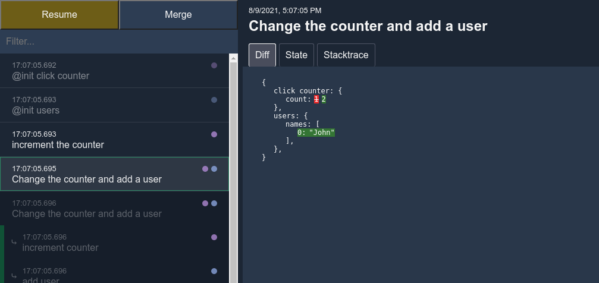
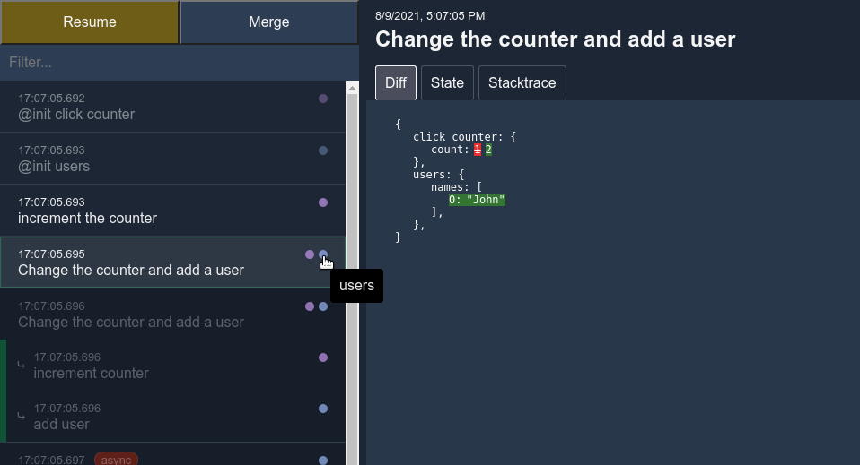
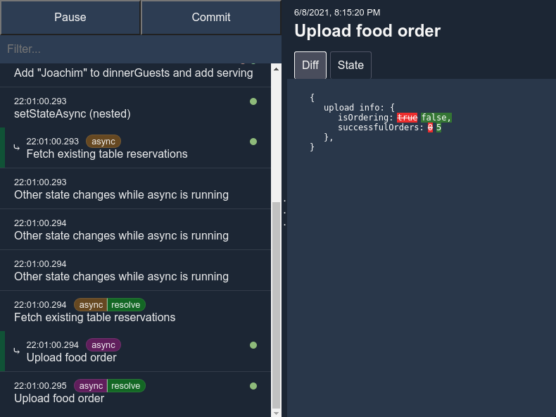

<!-- autogenerated by generate-readme.ts, do not edit -->
# @diffx/react <!-- replaceLine:Diffx -->

## Introduction

Diffx is a state management library that focuses on being easy to learn and use, and to offer a great development
experience at any scale.

## Features

* Minimal API
* No forced usage patterns
    * Minimizing boilerplate
* Supports asynchronous and nested changes to state
* Built with typescript
* [Devtools extension](#devtools-browser-extension) for Chrome
    * Step through states
    * View diffs, current state, and a stacktrace of what initiated the change
    * View and track nested state changes
    * View and track async state changes

## Supported frameworks

* [React](https://reactjs.org/) --> [@diffx/react](https://github.com/jbjorge/diffx/tree/master/react)
* [Vue.js](https://vuejs.org/) --> [@diffx/vue](https://github.com/jbjorge/diffx/tree/master/vue)
* [Angular](https://angular.io/) --> [@diffx/angular](https://github.com/jbjorge/diffx/tree/master/angular)
* [RxJS](https://rxjs.dev/) --> [@diffx/rxjs](https://github.com/jbjorge/diffx/tree/master/rxjs)
* No framework --> Described in this readme

## Installation

```shell
npm install @diffx/react
```

And install
the [devtools extension for Google Chrome](https://chrome.google.com/webstore/detail/diffx-devtools/ecijpnkbdaghilfokgbcieakdfbibeec)
for a better debugging experience.

## Usage

### `setDiffxOptions`

`setDiffxOptions(options)` is used to configure which global features to enable for Diffx.

```javascript
import { setDiffxOptions } from '@diffx/react';

setDiffxOptions({
    /**
     * Whether to record a history of state changes in-memory.
     * Useful if e.g. the application wants to upload the history that lead to a crash.
     * History can be obtained through `diffxInternals.getDiffs()`.
     *
     * Default: false
     **/
    createDiffs: false,
    /**
     * Enable viewing the state history in devtools.
     * If set to true, `createDiffs` will also be implicitly true since it
     * is required by devtools.
     *
     * Default: false
     */
    devtools: false,
    /**
     * Store a stack-trace with every history entry if `createDiffs` is enabled.
     * Will be displayed in devtools to help with tracking down
     * which code is making state changes.
     *
     * NOT recommended for production environments since creating stack traces is a slow operation!
     *
     * Default: false
     */
    includeStackTrace: false
})
```

### `createState`

`createState(namespace, state)` is used to create state in Diffx. It returns a readonly copy of the state which Diffx
will watch for changes.

* `namespace` - a string which is used as the key when storing the state in the state tree. _The namespace must be
  unique_.
* `state` - an object which contains the initial state

```javascript
import { createState } from '@diffx/react';

export const dinnerGuests = createState('dinnerGuests', { names: [] });
export const servings = createState('servings', { count: 0 });
```

The return value of `createState()` can be accessed as a regular object to read its values.

### `useDiffx` <!-- append:`createState` -->

`useDiffx(getterFunc)` is a React hook that enables reading the state in Diffx.

* `getterFunc` - a function that returns state or a projection of state.

```javascript
import { servings } from './the-above-example';
import { useDiffx } from '@diffx/react';

export default function App() {
    const dinnerServingsCount = useDiffx(() => servings.count);

    return (
        <div>
            <div>Current servings count: {dinnerServingsCount}</div>
        </div>
    );
}
```

### `setState`

`setState(reason, mutatorFunc)` is used to make changes to the state.

* `reason` - a string which explains why the state was changed. Will be displayed in the devtools extension for easier
  debugging.
* `mutatorFunc` - a function that wraps all changes to the state.

_Any changes made to the state outside of `setState()` will throw an error._

```javascript
import { setState } from '@diffx/react';
import { servings, dinnerGuests } from './the-above-example';

setState('Add guest to dinner party', () => {
    dinnerGuests.names.push('Kari Nordmann');
    servings.count++;
});

// this mutates the state outside of setState() and will throw an error
dinnerGuests.names.push('Karl the first');
```

#### Using `setState()` inside `setState()`

Diffx supports nesting/wrapping which enables a structured approach to setting state.

```javascript
import { setState } from '@diffx/react';
import { servings, dinnerGuests } from './the-above-example';

// The outer setState is used as a wrapper to create a context for the changes.
setState('Add guest with two kids', () => {
    addGuest('Bob the builder');
    setState('Add serving for kids', () => servings += 2);
})

function addGuest(name) {
    setState('Add guest', () => {
        dinnerGuests.names.push(name);
        servings++;
    });
}
```

### `setStateAsync`
`setStateAsync(reason, asyncMutatorFunc, onDone [, onError])` is used to make asynchronous changes
to the state (and enhances tracking of async state in Diffx devtools).

* `reason` - a string which explains why the state was changed. Will be displayed in the devtools extension for easier
  debugging.

* `asyncMutatorFunc` - a function that does async work (and returns a `Promise`).

* `onDone` - a function that receives the result of `asyncMutatorFunc` as an argument, and is free to change the state.

* `onError` - a function that receives the error from `asyncMutatorFunc` as an argument, and is free to change the
  state.

```javascript
import { createState, setState } from '@diffx/react';
import { servings } from './the-above-example';
import { orderFoodAsync } from './some-file';

export const orderState = createState('upload info', {
    isOrdering: false,
    successfulOrders: 0,
    errorMessage: ''
})

export function uploadGuests() {
    setStateAsync(
        'order food',
        () => {
            // set state before the async work begins
            orderState.errorMessage = '';
            orderState.successfulOrders = 0;
            orderState.isOrdering = true;
            // return the async work
            return orderFood(servings.count);
        },
        result => {
            // the async work succeeded
            orderState.isOrdering = false;
            orderState.successfulOrders = result;
        },
        error => {
            // the async work failed
            orderState.isOrdering = false;
            orderState.successfulOrders = 0;
            orderState.errorMessage = error.message;
        }
    )
}
```

### `watchState`

`watchState(stateGetter, options)` is used for watching the state and being notified/reacting when it changes.

* `stateGetter` - a function which returns the state(s) to be watched
* `options` - options object which describes how to watch the state
    * An error will be thrown if both `onChanged` and `onEachChange` are `undefined` (one of them needs to be set).

`watchState` is useful when creating "background services" that watches the state and reacts to changes.

```javascript
import { watchState } from '@diffx/react';
import { servings, dinnerGuests } from './the-above-example';

const unwatchFunc = watchState(() => dinnerGuests, {
    /**
     * [Optional]
     * Whether to emit the current value of the watched item(s).
     *
     * Default: false
     */
    lazy: false,

    /**
     * Callback called with the final state after
     * the .setState() function has finished running.
     */
    onChanged: newValue => 'do whatever you want',

    /**
     * Callback for each change to the state during .setState().
     */
    onEachChange: newValue => 'do whatever you want',

    /**
     * [Optional]
     * Custom comparer function to decide if the state has changed.
     * Receives newValue and oldValue as arguments and should return `true` for changed
     * and `false` for no change.
     *
     * Default: undefined, Diffx does automatic change comparison
     */
    hasChangedComparer: (newValue, oldValue) => true / false
});

// stop watching
unwatchFunc();
```

The `watchState()` function can also watch projections of state or multiple states

```javascript
// projection of state
watchState(
    () => servings.count - dinnerGuests.names.length,
    {
        onChanged: (extraServings) => 'do whatever you want'
    }
);

// multiple states (which is actually just a projection of state)
watchState(
    () => [dinnerGuests.names, servings.count],
    {
        onChanged: ([guestNames, servingsCount]) => 'do whatever you want'
    }
);
```

### `destroyState`

`destroyState(namespace)` is used for removing state from diffx.

* `namespace` - the namespace (string) to destroy

_Any watchers of the destroyed state will **not** be automatically unwatched_.

## Devtools browser extension

[Install Diffx devtools for Chrome](https://chrome.google.com/webstore/detail/diffx-devtools/ecijpnkbdaghilfokgbcieakdfbibeec)

The devtools browser extension is made to give insights into
* Why state was changed
* Which state was changed
* When did it change
* Who made the change

The list of changes to the state along with their `reason` provided in `setState(reason)` will be displayed in the left pane.
Tabs displaying `Diff`, `State` and `Stacktrace` (if stacktrace has been enabled in [setDiffxOptions](#setdiffxoptions)) are shown in the right pane.

### Diff tab 


### State tab


### Stacktrace tab


### State namespace indicators
The dots in the left tab indicate which state was changed with their color,
can be hovered to view the namespace and clicked to filter the list by that state.



### Nested setState/setStateAsync
For places where `setState()` has been used inside `setState()`, the left pane
will display a nested view with colors used for displaying nesting depth.


### Tracing setStateAsync
For operations done with `setStateAsync()`, the left pane will display an `async` tag
where the operation starts, and a `resolved` tag where the async operation finished.  
These tags are highlighted with a color to make it easier to spot and are also clickable to
filter by.



## Credits and thanks

* Thanks to the team behind [Vue.js](https://vuejs.org/) for making a great framework and the `@vue/reactive` package this
project depends on.
* Thanks to Benjamine, the creator of [jsondiffpatch](https://github.com/benjamine/jsondiffpatch) which this project uses
for creating diffs.
* Thanks to all developers teaming together to share their creations with others
