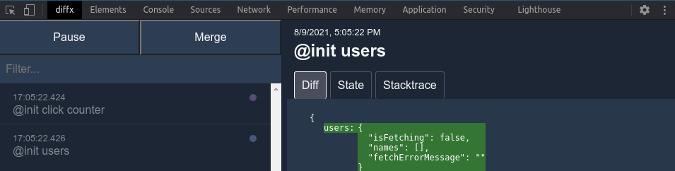
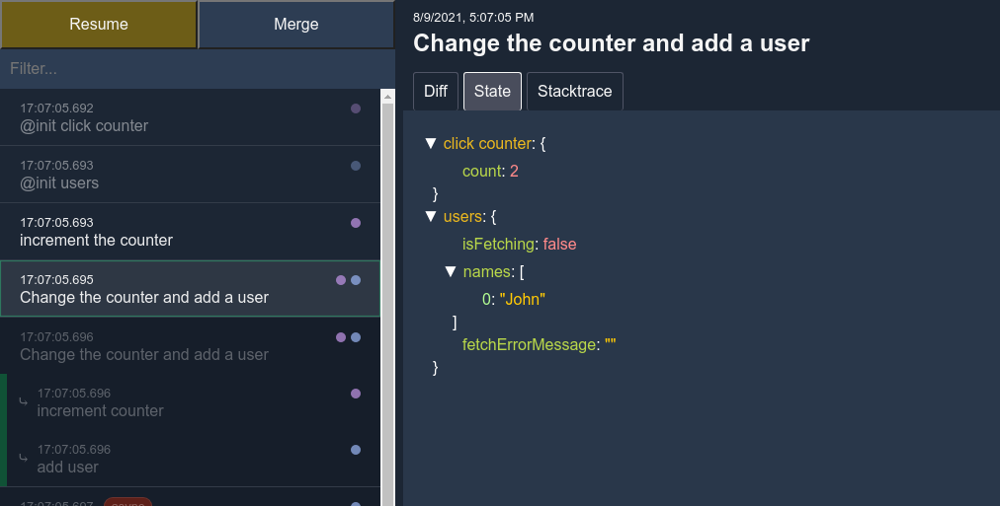
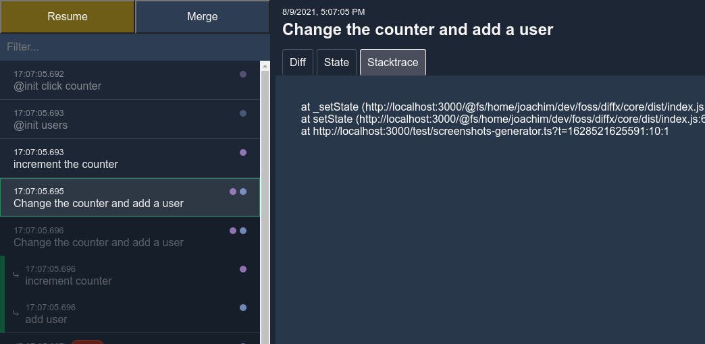
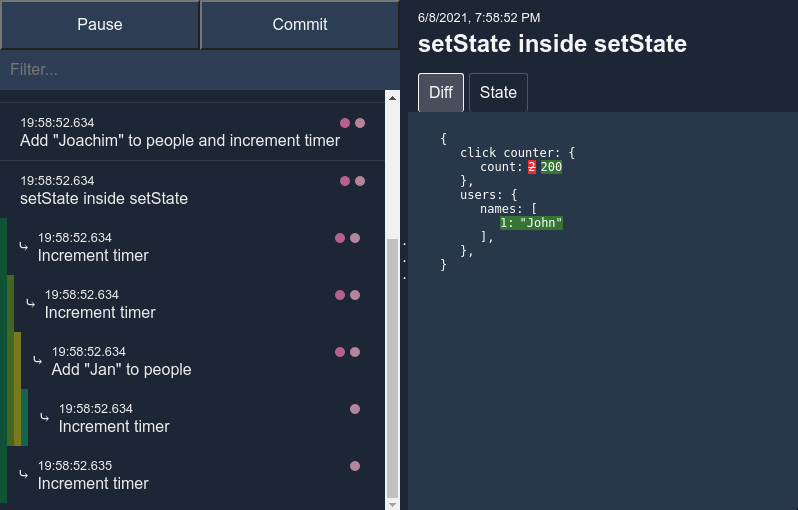

# @diffx/vue


Diffx is a state management library that focuses on three things:

* Make it easy to use
* Get rid of boilerplate
* Make great devtools

<details>
  <summary><strong>Show all features</strong></summary>

## Features

* Minimal API
* Minimal boilerplate
    * No forced usage patterns
    * Change any state from anywhere
    * Proxy/mutation based
* Detailed tracking
    * nested changes
    * asynchronous changes (start, resolve and reject)
    * changes done by watchers of the state
* Built in support for persistence
* Supports all major frameworks
* Built with typescript
* Devtools browser extension

</details>

## Supported frameworks

* [React](https://reactjs.org/) --> [@diffx/react](https://github.com/jbjorge/diffx/tree/master/react)
* [Vue.js](https://vuejs.org/) --> [@diffx/vue](https://github.com/jbjorge/diffx/tree/master/vue)
* [Svelte](https://svelte.dev/) --> [@diffx/svelte](https://github.com/jbjorge/diffx/tree/master/svelte)
* [Angular](https://angular.io/) --> [@diffx/angular](https://github.com/jbjorge/diffx/tree/master/angular)
* [RxJS](https://rxjs.dev/) --> [@diffx/rxjs](https://github.com/jbjorge/diffx/tree/master/rxjs)
* No framework --> [@diffx/core](https://github.com/jbjorge/diffx/tree/master/core)

## Installation

```shell
npm install @diffx/vue
```

And install
the [devtools browser extension](https://chrome.google.com/webstore/detail/diffx-devtools/ecijpnkbdaghilfokgbcieakdfbibeec)
for a better development experience ([view documentation](#devtools-browser-extension)).

## Usage

### setDiffxOptions()

`setDiffxOptions(options)` is used to configure which global features to enable for Diffx, and should ideally be run
before any code interacts with Diffx.

* `options` - an options object that configures how Diffx works internally

```javascript
import { setDiffxOptions } from '@diffx/vue';

setDiffxOptions({ devtools: true });
```

<details>
    <summary><strong>setDiffxOptions in-depth documentation</strong></summary>

```javascript
import { setDiffxOptions } from '@diffx/vue';

setDiffxOptions({
    /**
     * Whether to record all diffs of the state in-memory.
     *
     * Default: false
     **/
    createDiffs: boolean,
    /**
     * Enable viewing the state history in devtools.
     * Not recommended for use in a production environment.
     * If set to true, `createDiffs` will also be implicitly true.
     *
     * Default: false
     */
    devtools: boolean,
    /**
     * Store a stack-trace with every diff if `createDiffs` is enabled.
     * Will be displayed in devtools to help with tracking down
     * which code is making state changes.
     *
     * NOT recommended in production environment since creating stack traces is a slow operation!
     *
     * Default: false
     */
    includeStackTrace: boolean,
    /**
     * Persist the latest snapshot of all states and automatically use that as the initial state
     *
     * Default: false
     */
    persistent: boolean,
    /**
     * Location for storing persistent state.
     * E.g. localStorage or sessionStorage
     *
     * Default: null
     */
    persistenceLocation: PersistenceLocation,
    /**
     * Max nesting depth.
     *
     * If a loop of setState <--> watchState is accidentally created, it will run off and crash
     * (and potentially crash the main thread). To avoid this, a max nesting depth can be set.
     *
     * Default: 100
     */
    maxNestingDepth: number
})
```

</details>

### createState()

`createState(namespace, state)` is used to create state in Diffx.

* `namespace` - a string which is used as the key when storing the state in the state tree. _The namespace must be
  unique_.
* `state` - an object which contains the initial state

```javascript
import { createState } from '@diffx/vue';

const clickCounter = createState('click counter', { count: 0 });
console.log(clickCounter.count); // --> 0
```

<details>
    <summary><strong>createState in-depth documentation</strong></summary>

`createState(namespace, state, options)`

* `namespace` - a string which is used as the key when storing the state in the state tree. _The namespace must be
  unique_.
* `state` - an object which contains the initial state
* `options`- optional settings for this particular state
    * `persistent` - Persist the latest snapshot of this state and automatically use that as the initial state. Setting
      it to `false` will exclude the state from persistence, even though it is globally set to `true`
      in `setDiffxOptions`.  
      Default: `false`

    * `persistenceLocation` - Location for persisting this particular state - e.g. `window.sessionStorage`.  
      Default: `false`

```javascript
import { createState } from '@diffx/vue';

export const clickCounter = createState('click counter', { count: 0 });
export const users = createState('users', { names: [] });
```

You can create as many states as you like and access them as regular objects to read their values.

*If their value is changed without using [setState()](#setstate), Diffx will throw an error.*

```javascript
import { clickCounter } from './example-above';

clickCounter.count = 5; // this will throw an error
```

</details>

### setState()

`setState(reason, mutatorFunc)` is used to make changes to the state.

* `reason` - a string which explains why the state was changed. Will be displayed in the devtools extension for easier
  debugging.
* `mutatorFunc` - a function that wraps all changes to the state.

```javascript
import { setState } from '@diffx/vue';
import { clickCounter } from './createState-example-above';

setState('increment the counter', () => clickCounter.count++);
```

<details>
    <summary><strong>setState in-depth documentation</strong></summary>

### Synchronous setState()

`setState(reason, mutatorFunc)` is used to make changes to the state.

* `reason` - a string which explains why the state was changed. Will be displayed in the devtools extension for easier
  debugging.
* `mutatorFunc` - a function that wraps all changes to the state.

Since Diffx is proxy-based, it will keep track of both mutations and reassignment of values:

```javascript
import { setState } from '@diffx/vue';
import { clickCounter, users } from './createState-in-depth-docs';

setState('Change the counter and add a user', () => {
    clickCounter.count++;
    if (clickCounter.count > 2) {
        clickCounter.count = 200;
    }
    users.names.push('John');
})
```

##### Can I change the state directly instead of using `setState()`?

Diffx enforces the use of `setState(reason, mutatorFunc)` for making any changes to the state.  
By having the freedom to change state from *anywhere* in the codebase, state can quickly get out of control and be
difficult to debug if there is no human-readable reasoning behind why a change was made. That's why you're forced to
use setState and provide a `reason`.

_Any changes made to the state outside of `setState()` will throw an error._

```javascript
import { clickCounter } from './createState-example-above';

clickCounter.count++; // this will throw an error
```

### Using setState() inside setState()

Diffx supports and encourages nesting/wrapping which enables reuse of `setState`.

```javascript
import { setState } from '@diffx/vue';

import { clickCounter, users } from './createState-in-depth-docs';

const addUser = (name) => setState('add user', () => users.names.push('John'));
const incrementCounter = () => setState('increment counter', () => clickCounter.count++);

setState('Change the counter and add a user', () => {
    incrementCounter();
    if (clickCounter.count > 2) {
        clickCounter.count = 200;
    }
    addUser('John');
})
```

### Async setState()

`setState(reason, asyncMutatorFunc, onDone [, onError])` is used to make asynchronous changes to the state (and enhances
tracking of async state in Diffx devtools).

* `reason` - a string which explains why the state was changed. Will be displayed in the devtools extension for easier
  debugging.
* `asyncMutatorFunc` - a function that is free to change the state, and returns a `Promise`.
* `onDone` - a function that receives the result of `asyncMutatorFunc` as an argument, and is free to change the state.
* `onError` - a function that receives the error from `asyncMutatorFunc` as an argument, and is free to change the
  state.

```javascript
import { createState, setState } from '@diffx/vue';
import { fetchUsersFromServer } from './some-file';

export const users = createState('users-status', {
    isFetching: false,
    names: [],
    fetchErrorMessage: ''
});

setState(
    'fetch and update users',
    () => {
        // set state before the async work begins
        users.fetchErrorMessage = '';
        users.names = [];
        users.isFetching = true;
        // return the async work
        return fetchUsersFromServer();
    },
    result => {
        // the async work succeeded
        users.names = result;
        users.isFetching = false;
    },
    error => {
        // the async work failed
        users.fetchErrorMessage = error.message;
        users.isFetching = false;
    }
);
```

</details>

### watchState()

> Diffx works natively with Vue, and the state can be considered (and used) as a readonly `reactive` object.
> This means that the state can be used directly in `<template>`, `computed()`, `watchEffect()`, etc, and there is no need
to use watchState to access the state.

`watchState(stateGetter, options)` is used for watching the state and being notified/reacting when it changes.

* `stateGetter` - a function which returns the state(s) to be watched
* `callback` - a callback that will be called the next time the watched state changes

`watchState` is useful when creating "background services" that watches the state and reacts when it changes.

```javascript
import { watchState } from '@diffx/vue';
import { clickCounter } from './createState-example-above';

const unwatchFunc = watchState(
    () => clickCounter,
    (newValue, oldValue) => {
        console.log('counter changed to', newValue.count);
    }
);

// stop watching
unwatchFunc();
```

<details>
    <summary><strong>watchState in-depth documentation</strong></summary>

```javascript
import { watchState } from '@diffx/vue';
import { clickCounter } from './createState-example-above';

const unwatchFunc = watchState(() => clickCounter, {
    /**
     * Whether to emit the current value of the watched item(s).
     *
     * Default: `false`
     */
    emitInitialValue: true / false,
    /**
     * Callback called with the final state after the outermost `.setState` function has finished running.
     */
    onSetStateDone: (newValue, oldValue) => '...',
    /**
     * Callback called with the current state after each `.setState` has finished running
     * (including each .setState wrapped in .setState)
     */
    onEachSetState: (newValue, oldValue) => '...',
    /**
     * Callback for each change to the state during `.setState`.
     */
    onEachValueUpdate: (newValue, oldValue) => '...',
    /**
     * Custom comparer function to decide if the state has changed.
     * Receives newValue and oldValue as arguments and should return `true` for changed
     * and `false` for no change.
     *
     * Default: Diffx built in comparer
     */
    hasChangedComparer: (newValue, oldValue) => true / false,
    /**
     * Whether the watcher should automatically stop watching after the first changed value has
     * been emitted.
     *
     * Default: false
     */
    once: true / false
});

// stop watching
unwatchFunc();
```

The `watchState()` function can also watch projections of state or multiple states

Projection of state:

```javascript
import { watchState } from '@diffx/vue';
import { clickCounter } from './createState-example-above';

watchState(
    () => clickCounter.count > 5,
    isAboveFive => console.log(isAboveFive)
);
```

Multiple states (which is actually just a projection of state):

```javascript
import { watchState } from '@diffx/vue';
import { clickCounter, users } from './createState-in-depth-docs';

watchState(
    () => [clickCounter.count, users.names],
    ([clickCount, names]) => console.log(clickCount, names)
);
```

If a watcher changes state, this will also be tracked in the devtools:

```javascript
import { watchState, setState } from '@diffx/vue';
import { clickCounter, users } from './createState-in-depth-docs';

watchState(
    () => clickCounter.count === 5,
    countIsFive => {
        if (!countIsFive) return;
        setState('counter has the value 5, so I added another user', () => {
            users.names.push('Jenny');
        });
    }
);
```

</details>

### destroyState()

`destroyState(namespace)` is used for removing state from diffx.

* `namespace` - the namespace (string) to destroy

_Any watchers of the destroyed state will **not** be automatically unwatched_.

```javascript
import { destroyState } from '@diffx/vue';

destroyState('click counter');
```

## Devtools browser extension

[Install Diffx devtools for Chrome](https://chrome.google.com/webstore/detail/diffx-devtools/ecijpnkbdaghilfokgbcieakdfbibeec)

Diffx devtools is made to give insights into

* Why state was changed
* Which state was changed
* When did it change
* What caused the change

The extension will show up as a tab in the browser devtools when it detects that the page is using Diffx, and the
devtools option is set to `true` [(see setDiffxOptions)](#setdiffxoptions).



The left pane displays a list of changes (diffs) to the state along with their `reason`.  
The right pane displays the `Diff`, `State` and `Stacktrace` (if stacktrace has been enabled
in [setDiffxOptions](#setdiffxoptions)).

### Diff tab

Displays the difference between each change made by `setState()`.


### State tab

Displays the current state at the selected diff.



### Stacktrace tab

Displays the stack trace for the code that led to this state change.



### State namespace indicators

The dots in the left tab indicate which state was changed with their color, can be hovered to view the namespace and
clicked to filter the list by that state.


### Nested setState/setState

For places where `setState()` has been used inside `setState()`, the left pane will display a nested view with colors
used for displaying nesting depth.



### Tracing async setState

For operations done with `setState()`, the left pane will display an `async` tag where the operation starts, and
a `resolve`/`reject`  tag where the async operation finished.  
These tags are highlighted with a color to make it easier to spot and are also clickable to filter by.


### Tracing state changed in watchState

If a `watchState()` runs `setState()`, the left pane will display a `watcher` tag to indicate that the change was
triggered.


The `watcher` tag can be hovered to see which state change triggered it and clicked to find the state change.


To see where in the code the watcher was run, enable `includeStackTrace` in [setDiffxOptions](#setdiffxoptions) and open
the Stacktrace tab for the entry tagged with the `watcher`.

### Highlight/filter changes to a specific value

The Highlight and Filter button can be used to find the state changes that affected a specific value.


## Diffx compared to other state management libraries

There are **a lot** of great state management libraries out there.  
Some focus on a rigid structure, suitable for large teams that want predictable code patterns, sometimes at the cost of
writing a lot of boilerplate code.  
Others give freedom to the developers to use it how they see fit at the cost of potentially losing control due to lack
of structure/patterns.

Diffx aims to get rid of the need for patterns by making it the library's responsibility to stay in control, and let the
developer stay on top of any shenanigans with the devtools extension.

#### Is it better than Redux/Zustand/Mobx/Valtio/Vuex/Recoil/jotai/...?

I don't know. I haven't spent time trying all of them (yet).  
There are a heap of great choices out there, and the library you end up using will probably stay in your project for a
long time.  
I recommend you to look into several of the popular ones and see if you like them better than Diffx.

## Credits and thanks

* Thanks to the team behind [Vue.js](https://vuejs.org/) for making a great framework and the `@vue/reactive` package
  this project depends on.
* Thanks to Benjamine, the creator of [jsondiffpatch](https://github.com/benjamine/jsondiffpatch) which this project
  uses for creating diffs.
* Thanks to all developers teaming together to share their creations with others
